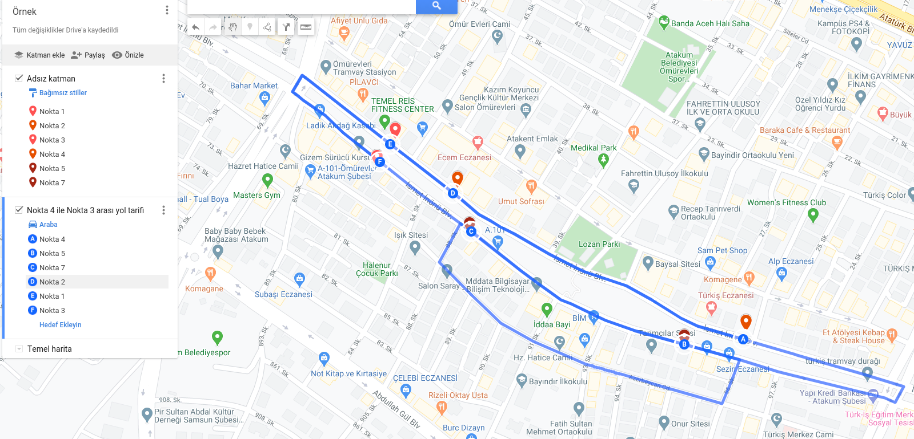
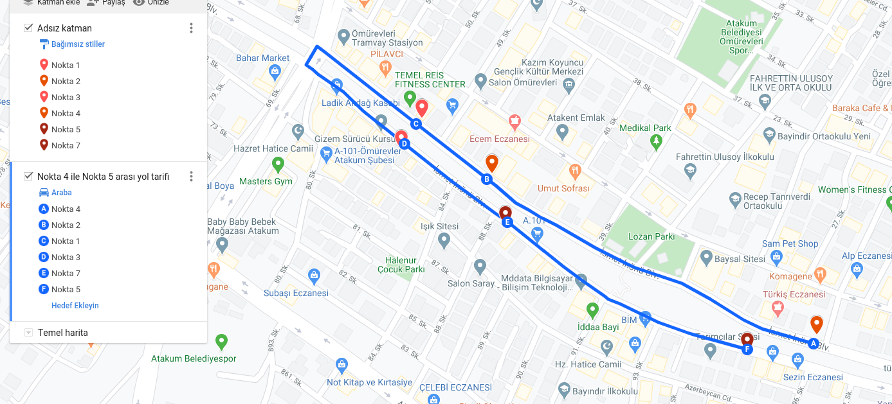

# routenodeserver

## KISA MESAFELERDE HATALI ÇALIŞIYOR, KULLANMAYIN.

Google'dan herhangi bir veri almadığı için tamamen mesafe bazlı çalıştığından dolayı hatalı. Uzun bir caddede güzergah üzerinde teslimat noktası olmasına rağmen yolun karşısındaki bina daha yakın mesafede olduğu için onu sıraya koyuyor. Örnek:



Olması Gereken:




API URI =>   /api/v1/sortlocations  

REQUEST SAMPLE

```json
{
	"locations": [

		{
			"title": "Atakum Belediye Parki",
			"latitude": 41.336146,
			"longitude": 36.266150
		},
		{
			"title": "Turkis Tramway Duragi",
			"latitude": 41.332714,
			"longitude": 36.270599
		},
		{
			"title": "Carrefoure Mimarsinan Sube",
			"latitude": 41.333117,
			"longitude": 36.281856
		},
		{
			"title": "Mevlana Konak Evleri",
			"latitude": 41.321483,
			"longitude": 36.276780
		},
		{
			"title": "Gokdelen Kule",
			"latitude": 41.312900,
			"longitude": 36.280850
		},
		{
			"title": "Samsun Il Emniyet Mudurlugu",
			"latitude": 41.324793,
			"longitude": 36.307974
		},
		{
			"title": "Kolpinar Koy Mezarligi",
			"latitude": 41.307542,
			"longitude": 36.289866
		},
		{
			"title": "Amisos Tepesi",
			"latitude": 41.319211,
			"longitude": 36.322328
		},
		{
			"title": "Ihlamur Kafe",
			"latitude": 41.313925,
			"longitude": 36.322993
		},
		{
			"title": "Samsun Okculuk Tesisleri",
			"latitude": 41.319775,
			"longitude": 36.334305
		}
	]
}

```


RESPONSE SAMPLE =>
```json

{
    "success": "true",
    "message": "sorted successfully",
    "data": [
        {
            "title": "Atakum Belediye Parki",
            "latitude": 41.336146,
            "longitude": 36.26615,
            "distance": "30.98"
        },
        {
            "title": "Turkis Tramway Duragi",
            "latitude": 41.332714,
            "longitude": 36.270599,
            "distance": "31.50"
        },
        {
            "title": "Carrefoure Mimarsinan Sube",
            "latitude": 41.333117,
            "longitude": 36.281856,
            "distance": "32.27"
        },
        {
            "title": "Mevlana Konak Evleri",
            "latitude": 41.321483,
            "longitude": 36.27678,
            "distance": "32.62"
        },
        {
            "title": "Gokdelen Kule",
            "latitude": 41.3129,
            "longitude": 36.28085,
            "distance": "33.45"
        },
        {
            "title": "Kolpinar Koy Mezarligi",
            "latitude": 41.307542,
            "longitude": 36.289866,
            "distance": "34.41"
        },
        {
            "title": "Samsun Il Emniyet Mudurlugu",
            "latitude": 41.324793,
            "longitude": 36.307974,
            "distance": "34.61"
        },
        {
            "title": "Amisos Tepesi",
            "latitude": 41.319211,
            "longitude": 36.322328,
            "distance": "35.95"
        },
        {
            "title": "Ihlamur Kafe",
            "latitude": 41.313925,
            "longitude": 36.322993,
            "distance": "36.31"
        },
        {
            "title": "Samsun Okculuk Tesisleri",
            "latitude": 41.319775,
            "longitude": 36.334305,
            "distance": "36.78"
        }
    ]
}

```
